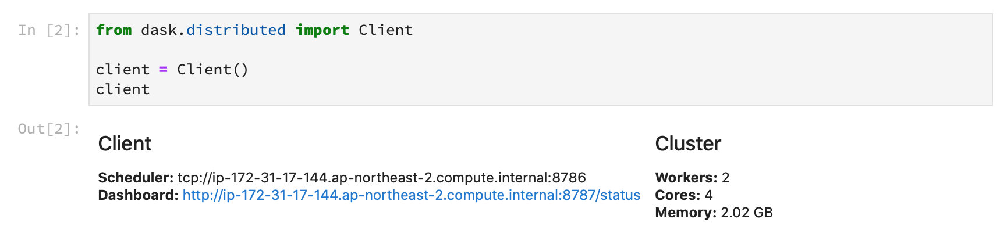

bilbo (빌보) 는 AWS 상에서 파이썬 데이터 엔지니어링/과학용 클러스터를 만들고 관리해주는 툴이다. 현재 [Dask](https://dask.org) 를 지원하고, 앞으로 [Ray](https://github.com/ray-project/ray) 도 지원할 예정이다. 클러스터 생성 없이 분석 노트북만을 위한 용도로 사용해도 괜찮다.

다음과 같은 일을 할 수 있다.

* 설정에 맞게 AWS에 클러스터 생성
* 노트북/대쉬보드를 브라우저로 오픈
* 클러스터 정보 보기 및 재시작
* 생성된 클러스터 제거

bilbo 는 Linux, macOS, Windows 에서 사용 가능하며, Python 3.6 이상 버전을 필요로 한다. 또한 AWS 를 기반으로 하기에, 유저는 AWS 계정이 있고 기본적인 대쉬보드 사용이 가능한 것으로 가정하겠다.

---
- [- bilbo 의 업데이트와 제거](#ullibilbo-의-업데이트와-제거liul)
- [준비 작업](#준비-작업)
  - [bilbo 설치](#bilbo-설치)
  - [AWS 환경 준비](#aws-환경-준비)
  - [AMI (Amazon Machine Image) 만들기](#ami-amazon-machine-image-만들기)
    - [Packer 설정 파일 만들기](#packer-설정-파일-만들기)
    - [설치 스크립트](#설치-스크립트)
    - [Packer로 AMI 만들기](#packer로-ami-만들기)
  - [EC2 보안 그룹 생성하기](#ec2-보안-그룹-생성하기)
- [시작하기](#시작하기)
  - [가장 간단한 프로파일](#가장-간단한-프로파일)
  - [노트북 인스턴스 명시하기](#노트북-인스턴스-명시하기)
  - [클러스터 만들기](#클러스터-만들기)
  - [클러스터 확인 및 노트북 열기](#클러스터-확인-및-노트북-열기)
  - [클러스터 제거하기](#클러스터-제거하기)
- [Dask 클러스터](#dask-클러스터)
  - [로컬 노트북에서 클라우드 Dask 이용하기](#로컬-노트북에서-클라우드-dask-이용하기)
  - [클라우드 노트북에서 클라우드 Dask 이용하기](#클라우드-노트북에서-클라우드-dask-이용하기)
  - [워커 설정](#워커-설정)
- [활용하기](#활용하기)
  - [작업 폴더 지정](#작업-폴더-지정)
  - [Git 저장소에서 코드 받기](#git-저장소에서-코드-받기)
  - [인스턴스 접두어 붙이기](#인스턴스-접두어-붙이기)
  - [태그 붙이기](#태그-붙이기)
  - [CLI 패러미터로 프로파일 값 덮어쓰기](#cli-패러미터로-프로파일-값-덮어쓰기)
  - [원격 장비에서 명령 실행](#원격-장비에서-명령-실행)
  - [클러스터 재시작](#클러스터-재시작)
  - [노트북용 클러스터와 분산 작업용 클러스터의 프로파일 분리](#노트북용-클러스터와-분산-작업용-클러스터의-프로파일-분리)
  - [클러스터 중단과 재개](#클러스터-중단과-재개)
  - [초기화 명령어 실행](#초기화-명령어-실행)
  - [원격으로 노트북 / 파이썬 파일 실행하기](#원격으로-노트북--파이썬-파일-실행하기)
  - [원격 명령 실패 여부에 따른 처리](#원격-명령-실패-여부에-따른-처리)
  - [같은 VPC 인스턴스에서 bilbo 사용하기](#같은-vpc-인스턴스에서-bilbo-사용하기)
  - [WSL (Windows Subsystem for Linux) 에서 문제](#wsl-windows-subsystem-for-linux-에서-문제)
  - [bilbo 의 업데이트와 제거](#bilbo-의-업데이트와-제거)
---

## 준비 작업

### bilbo 설치

아래와 같이 코드를 클론하고,

    $ git clone https://github.com/haje01/bilbo.git

클론된 디렉토리로 이동 후 `pip` 로 설치한다.

    $ pip install -e .

설치가 잘 되었으면 bilbo 에 어떤 명령이 있는지 살펴보자.

    $ bilbo

    Usage: bilbo [OPTIONS] COMMAND [ARGS]...

    Options:
    -v, --verbose  Increase message verbosity.
    --help         Show this message and exit.

    Commands:
      create         Create a cluster.
      dashboard      Open dashboard.
      desc           Describe a cluster.
      destroy        Destroy a cluster.
      destroyfailed  Destroy a cluster if last rcmd failed.
      ls             List active clusters.
      notebook       Open notebook.
      pause          Pause a cluster.
      plan           Show cluster creation plan.
      profiles       List all profiles.
      rcmd           Command to a cluster instance.
      restart        Restart a cluster service.
      resume         Resume a cluster.
      run            Run remote notebook or python file.
      version        Show bilbo version.   

다양한 명령들이 있는 데 하나씩 살펴볼 것이다. 간단히 bilbo 의 버전을 알아보자.

    $ bilbo version

    0.0.1

각 명령별 도움말도 있는데, 예를 들어 `create` 명령에 대한 도움말은 아래와 같이 볼 수 있다:

    $ bilbo create --help

    Usage: bilbo create [OPTIONS] PROFILE

    Create cluster.

    Options:
    -c, --cluster TEXT  Cluster name (Default: Profile name).
    -p, --param TEXT    Override profile by parameter.
    -n, --notebook      Open remote notebook when cluster is ready.
    -d, --dashboard     Open remote dashboard when cluster is ready.
    --help              Show this message and exit.


bilbo 를 최초로 실행하면 설치된 OS의 유저 홈 디렉토리 아래에 `.bilbo` 라는 디렉토리가 생성되는데, 이것을 **bilbo 홈 디렉토리**로 부르겠다. OS 별 위치는 다음과 같다.

* Linux - `/home/<UserName>/.bilbo`
* macOS - `/Users/<UserName>/.bilbo`
* Windows - `C:\Users\<UserName>\.bilbo`

bilbo 홈 디렉토리는 편의상 `~/.bilbo` 로 칭하겠다. 참고로, 이 안에는 다음과 같은 하위 디렉토리가 있다.

    ~/.bilbo
        clusters/  # 생성된 클러스터 정보
        logs/      # 로그 디렉토리
        profiles/  # 프로파일 디렉토리

> **주의 :** bilbo 홈 디렉토리에는 설정 내용에 따라 민감한 내용이 들어갈 수 있으니 유출되지 않도록 조심하자!

### AWS 환경 준비

AWS EC2 인스턴스를 만들고 관리하기 위해 아래의 준비가 필요하다.

* EC2 용 키페어(Key Pair)
* AWS IAM 유저
* AWS 환경변수 설정

키페어는 한 번이라도 EC2 인스턴스를 만들었다면 준비되어 있을 것이다. 아니라면 [관련 글](https://victorydntmd.tistory.com/61)을 참고하여 준비하자.

사용 가능한 IAM 유저가 없다면, [이 글](https://www.44bits.io/ko/post/publishing_and_managing_aws_user_access_key) 을 참고하여 만들자. 이 과정에서 얻은 Access / Secret 키를 기록해 두자.

환경변수는 다음과 같은 세 가지를 사용한다:

* `AWS_ACCESS_KEY_ID` - IAM 유저의 Access 키
* `AWS_SECRET_ACCESS_KEY` - IAM 유저의 Secret 키
* `AWS_DEFAULT_REGION` - 기본 AWS 리전 (한국은 `ap-northeast-2`)

위의 환경변수가 명령창(터미널)을 띄울 때마다 활성화되도록 로컬 OS에 맞게 설정하자 (AWS CLI 툴을 설치 및 설정해둔 경우는 환경변수가 필요없다).

### AMI (Amazon Machine Image) 만들기

데이터 과학에 필요한 여러 패키지를 설치한 AMI를 미리 만들어 두면, 필요할 때 바로 VM 인스턴스를 띄워서 쓸 수 있다. AMI는 인스턴스를 만들어서 직접 설치 후 AWS EC2 대쉬보드의 `이미지 생성` 명령을 통해 만들 수도 있으나, **형상 관리가 힘든 문제**점이 있다.

*재현 가능한 데이터 과학* 을 위해서는 이미지 명세를 텍스트로 작성하고, 이것을 git 등으로 관리하는 것이 좋은데, 이를 위해 HashiCorp 의 [Packer](https://www.packer.io) 를 사용하는 것을 추천한다. 먼저 [Packer Install](https://www.packer.io/intro/getting-started/install.html) 을 참고하여 Packer 를 설치하자.

설명에서는 기계학습을 위한 이미지를 가정해, AWS에서 제공하는 `Deep Learning AMI (Ubuntu 16.04) Version 26.0` 을 소스 AMI로 하겠다 (CUDA 등이 미리 설치되어있어 향후 GPU 인스턴스를 사용할 때 편리하다). bilbo 를 위해 필수로 설치해야 하는 것들은 다음과 같다.

* 클러스터 - Dask 관련 패키지
* 노트북 - Jupyter Lab을 기준으로 한다.
* 기타 - Python 데이터 과학 패키지

노트북/스케쥴러/워커 등 인스턴스 역할별로 AMI 를 따로 만들어 사용할 수 도 있으나, 유지보수의 편의상 모두 하나의 AMI 에 설치하겠다.

#### Packer 설정 파일 만들기

Packer의 설정파일은 `.json` 형식으로 기술한다. 적당한 이미지 생성용 디렉토리에 아래 내용을 `bilbo-image.json`으로 저장한다.

```json
{
    "variables": {
        "aws_access_key": "{{env `AWS_ACCESS_KEY_ID`}}",
        "aws_secret_key": "{{env `AWS_SECRET_ACCESS_KEY`}}",
        "region":         "ap-northeast-2"
    },
    "builders": [
        {
            "type": "amazon-ebs",
            "access_key": "{{user `aws_access_key`}}",
            "ami_name": "bilbo-image",
            "source_ami": "ami-099a57eaf71294a34",
            "instance_type": "t3.medium",
            "region": "{{user `region`}}",
            "secret_key": "{{user `aws_secret_key`}}",
            "ssh_username": "ubuntu"
        }
    ],
    "provisioners": [
        {
            "type": "shell",
            "script": "setup.sh"
        }
    ]
}
```

* ``{{env `AWS_ACCESS_KEY_ID`}}`` 는 앞에서 언급한 환경 변수 `AWS_ACCESS_KEY_ID` 를 읽어오는 부분이다.
* `instance-type` 은 이미지를 만들기 위한 VM 의 타입이다. Jupyter Lab 익스텐션 설치시 메모리가 꽤 필요하기에,  `t3.medium` 정도로 해준다.
* `provisioners` 아래에 설치 스크립트가 온다.
* 필요한 패키지의 설치는 `setup.sh` 에 별도로 기술한다.

#### 설치 스크립트

아래의 내용을 참고하여, 필요에 맞게 변경해 `setup.sh` 로 저장한다.

```sh
# Common setup
sudo apt-get remove -y unattended-upgrades
sudo locale-gen ko_KR.UTF-8
sudo apt-get update

# Custom installs
curl -sL https://deb.nodesource.com/setup_12.x | sudo -E bash -
sudo DEBIAN_FRONTEND=noninteractive apt-get install -y nodejs

pip install blosc
pip install lz4
pip install python-snappy
pip install 'distributed==2.9.1'
pip install 'dask>=2.9.1'
pip install 'numpy>=1.17.3'
pip install 'pandas>=0.25.'
pip install 'jupyterlab>=0.35.0'
jupyter labextension install @jupyterlab/toc
jupyter labextension install @jupyterlab/celltags
pip install 'dask-labextension>=1.0.3'
jupyter labextension install dask-labextension
pip install graphviz
pip install pyarrow
pip install papermill
pip install 's3fs>=0.4.0'
pip install 'fsspec>=0.6.2'
```

> **주의 :** 현재 (2020년 1월) [distributed 2.9.2 는 Python 3.6 에서 에러가 발생](https://github.com/dask/distributed/issues/3381) 하여 2.9.1 로 고정했다. 상황에 맞게 수정하여 사용하면 되겠다.

#### Packer로 AMI 만들기

이제 아래의 명령으로 AMI 를 만든다.

    $ packer build bilbo-image.json

다음과 같은 메시지가 출력되면서 이미지가 만들어진다.

```
amazon-ebs output will be in this color.

==> amazon-ebs: Prevalidating AMI Name: bilbo-image
    amazon-ebs: Found Image ID: ami-099a57eaf71294a34
==> amazon-ebs: Creating temporary keypair: packer_5df1eac8-747c-6001-e73c-69e4ac04a837
==> amazon-ebs: Creating temporary security group for this instance: packer_5df1eac9-a29b-6906-c99d-5b7a96ceb707
==> amazon-ebs: Authorizing access to port 22 from [0.0.0.0/0] in the temporary security groups...
==> amazon-ebs: Launching a source AWS instance...
==> amazon-ebs: Adding tags to source instance
    amazon-ebs: Adding tag: "Name": "Packer Builder"
    amazon-ebs: Instance ID: i-03006f5bbab3e077c
==> amazon-ebs: Waiting for instance (i-03006f5bbab3e077c) to become ready...

.
.
.

==> amazon-ebs: Waiting for AMI to become ready...
==> amazon-ebs: Terminating the source AWS instance...
==> amazon-ebs: Cleaning up any extra volumes...
==> amazon-ebs: No volumes to clean up, skipping
==> amazon-ebs: Deleting temporary security group...
==> amazon-ebs: Deleting temporary keypair...
Build 'amazon-ebs' finished.

==> Builds finished. The artifacts of successful builds are:
--> amazon-ebs: AMIs were created:
ap-northeast-2: ami-043c907754421d916
```

성공하면 최종적으로 `ami-043c907754421d916` 와 같은 AMI ID 가 출력된다. 이 값을 기록해 두고, 이후 bilbo 에서 사용한다.

이미지 만들기에 사용된 인스턴스는 자동으로 삭제되며, 생성된 이미지는 AWS EC2 대쉬보드 왼쪽 `AMI` 메뉴에서 AMI ID 또는 이름으로 확인할 수 있다.

위 과정에서 사용한 Packer 설정 파일 (`bilbo-image.json`) 및 설치 스크립트(`setup.sh`) 를 코드 저장소에 추가하여 관리하면 될 것이다.

### EC2 보안 그룹 생성하기

클러스터의 용도에 맞도록 VM 에 접근 제한을 하면 더 안전하게 클러스터를 사용할 수 있다. 여기서는 bilbo 를 통해 Dask 클러스터와 Jupyter 노트북을 사용하는 것을 가정하고 보안 그룹을 만들어 보겠다. 필요에 따라 설정을 변경/추가하여 사용하기 바란다.

* AWS EC2 대쉬보드로 이동후 `보안 그룹 생성`을 누른다.
* 보안 그룹 이름과 설명을 적절히 입력 (영어로).
* VPC는 기본값을 선택
* 다음과 같이 인바운드 규칙을 추가한다.
  * 유형: `SSH`, 포트 범위: `22`, 소스 `내 IP`, 설명: `SSH`
  * 유형: `사용자 지정 TCP`, 포트 범위: `8786`, 소스: `내 IP`, 설명: `Dask Scheduler`
  * 유형: `사용자 지정 TCP`, 포트 범위: `8787`, 소스: `내 IP`, 설명: `Dask Dashboard`
  * 유형: `사용자 지정 TCP`, 포트 범위: `8888`, 소스: `내 IP`, 설명: `Jupyter Notebook`
* `생성` 버튼을 눌러 보안 그룹을 만들고 대쉬보드에서 확인


추가로 클러스터 인스턴스들 사이의 내부 통신을 위해 아래의 작업을 해야 한다. AWS EC2 대쉬보드 아래 보안그룹에서

* AWS EC2 대쉬보드 아래 보안그룹에서 생성된 보안 그룹을 선택한다.
* 아래의 `설명` 탭에서 생성된 보안 그룹의 ID(`sg-` 로 시작하는)를 복사한다.
* `작업` / `인바운드 규칙 편집` 을 누른다.
* `규칙 추가` 를 누른 뒤, 유형: `모든 TCP`, 소스: `사용자 지정` 에서 복사해둔 보안 그룹 ID 기입, 설명: `Dask Inside`

최종적으로는 다음과 같은 모습이 될 것이다.


 `저장` 을 누르고, 이 보안 그룹의 ID 를 이후 bilbo 에서 사용한다.

## 시작하기

모든 준비가 완료되었으면, 이제 bilbo 의 설정 파일을 만들어 보자. 클러스터를 만들기 위한 이 설정 파일을 **프로파일** 이라고 부르겠다. 다양한 설정의 프로파일을 준비해 두고, 필요에 따라 그것에 기반한 클러스터를 만들어 사용하게 된다.

bilbo 의 프로파일은 `.json` 형식으로 기술하는데, 이를 위한 [JSON 스키마](https://json-schema.org) 를 제공한다. [VS Code](https://code.visualstudio.com) 처럼 JSON 스키마를 지원하는 에디터를 사용하면, 인텔리센스와 검증 기능이 있어 편리하다.

프로파일은 `~/.bilbo/profiles` 디렉토리에 저장한다.

> **주의 :** `.json` 파일의 인코딩은 `utf-8` 로 하자.

### 가장 간단한 프로파일

아래는 가장 단순한 프로파일의 예이다. 이 내용을 `~/.bilbo/profiles/test.json` 으로 저장하자.

```json
{
    "$schema": "https://raw.githubusercontent.com/haje01/bilbo/master/schemas/profile-01.schema.json",
    "description": "최소 테스트",
    "instance": {
        "ami": "ami-0f49fa254e1806b72",
        "security_group": "sg-0bc538e0a7c089b4d",
        "ec2type": "t3.micro",
        "keyname": "my-keypair",
        "ssh_user": "ubuntu",
        "ssh_private_key": "~/.ssh/my-private.pem"
    }
}
```

* `$schema` 로 bilbo 프로파일의 JSON 스키마를 지정한다 (옵션).
* `description`: 이 프로파일의 용도를 설명 (옵션이나 가급적 명시하는 것을 추천).
* `instance` 요소에 클러스터에서 사용할 공통 장비의 사양을 명시한다.
  * `ami` - 만들어 둔 AMI 의 ID
  * `security_group` - 만들어 둔 보안 그룹의 ID
  * `ec2type` - 사용할 EC2 인스턴스의 타입
  * `keyname` - 사용할 AWS 키페어의 이름
  * `ssh_user` - 인스턴스 생성 후 SSH 로그인할 유저 (우분투는 `ubuntu`, Amazon Linux 면 `ec2-user`)
  * `ssh_private_key` - 키페어의 프라이빗키 경로

> 선택적으로 인스턴스 루트 디바이스 (디스크) 의 크기를 줄 수 있다. 크기는 GB 단위로 명시한다. 명시하지 않으면 EC2 인스턴스 타입의 기본 크기를 이용한다.
> ```
> "instance": {
>   "vol_size": 100
> }
> ```

이 프로파일은 단순히 공통 인스턴스의 정보를 명시할 뿐, 실제로 어떤 인스턴스도 만들지 않는다. 향후 만들게 될 노트북이나 클러스터에서 별도 인스턴스 정보가 없다면 이것을 사용하게 되며, 별도 인스턴스 정보가 있다면 그것이 우선된다. 아래와 같은 `plan` 명령으로 프로파일의 생성 계획을 미리 확인할 수 있다.

> **주의 :** bilbo 명령에서 **프로파일은 확장자를 포함한 파일명**(`test.json`)으로 사용한다.

    $ bilbo plan test.json

    Nothing to do.

### 노트북 인스턴스 명시하기

bilbo 는 분석을 위한 1) 노트북이 사용자의 로컬 머신에 있을 수도 있고, 2) 클라우드에 만들어 사용할 수도 있다고 가정한다. 여기에서는 위의 프로파일을 수정하여, 클라우드 (AWS) 에 노트북 인스턴스가 만들어지도록 해보겠다.

> **주의 :** 분석 노트북은 Jupyter Lab을 기준으로 한다. bilbo 는 AMI 에 Jupyter Lab이 설치되어 있다고 가정한다.

```json
{
    "$schema": "https://raw.githubusercontent.com/haje01/bilbo/master/schemas/profile-01.schema.json",
    "description": "클라우드 노트북 테스트",
    "instance": {
        "ami": "ami-0f49fa254e1806b72",
        "security_group": "sg-0bc538e0a7c089b4d",
        "ec2type": "t3.micro",
        "keyname": "my-keypair",
        "ssh_user": "ubuntu",
        "ssh_private_key": "~/.ssh/my-keypair.pem"
    },
    "notebook": {}
}
```

`notebook` 요소는 비어있는데, 여기에 `instance` 를 따로 명시하면 공용 인스턴스 설정이 아닌 노트북 전용의 설정을 할 수 있다. 여기에서는 빈 값으로 하여 공용 인스턴스 그대로 노트북 인스턴스를 만들겠다.

계획을 다시 확인해보면 노트북 인스턴스가 만들어질 것을 알 수 있다.

    $ bilbo plan test.json

      Notebook:
        AMI: ami-0f49fa254e1806b72
        Instance Type: t3.micro
        Security Group: sg-0bc538e0a7c089b4d
        Key Name: my-keypair


### 클러스터 만들기

프로파일 정보를 참고하여 만들어진 VM 인스턴스의 그룹을 **클러스터**로 부른다. 앞에서 만든 프로파일을 이용해, 실제 클러스터를 만들어보자.

    $ bilbo create test.json

    CRITICAL: Create notebook.
    CRITICAL: Start notebook.

    Cluster Name: test
    Ready Time: 2020-01-08 15:45:29

    Notebook:
    [1] instance_id: i-0a6dc0cca2f9aaa22, public_ip: 13.125.147.196

노트북 인스턴스 하나가 만들어졌고, 그것의 인스턴스 ID 와 퍼블릭 IP 를 확인할 수 있다. 클러스터 이름은 따로 지정되지 않으면, 프로파일 이름에서 확장자를 제외한 것이 기본으로 쓰인다. 위에서는 `test` 가 클러스터 이름이 된다. 예를 들어 다음처럼 클러스터 이름을 명시적으로 줄 수도 있다.

    $ bilbo create test.json -c test-cluster

AWS EC2 대쉬보드에서도 생성된 노트북 인스턴스를 볼 수 있다. `클러스터명-notebook` 형식 이름을 갖는다.


### 클러스터 확인 및 노트북 열기

만들어진 클러스터들은 아래와 같이 확인할 수 있다.

    $ bilbo ls

    test : 클라우드 노트북 테스트

현재는 `test` 클러스터 하나만 확인된다. 구체적인 클러스터 정보는 (`create` 후 출력되는 정보와 같음) `desc` 명령으로 볼 수 있다.

> **주의 :** 프로파일과 달리 클러스터 이름에는 확장자 `.json` 이 없다. 이렇게 하는 이유는, 프로파일 이름 그대로 클러스터 이름을 쓰는 경우가 많기 때문에, 둘을 구분하기 위해서이다.


    $ bilbo desc test

    Cluster Name: test
    Ready Time: 2020-01-08 17:20:45

    Notebook:
    [1] instance_id: i-0b90d9d9e7d43ad4e, public_ip: 13.124.174.197


`-d` 옵션을 주면 더 상세한 정보를 JSON 형식으로 표시한다.

    $ bilbo desc test -d

    {
        "instances": [
            "i-0b90d9d9e7d43ad4e"
        ],
        "name": "test",
        "notebook": {
            "ec2type": "t3.micro",
            "image_id": "ami-0f49fa254e1806b72",
            "instance_id": "i-0b90d9d9e7d43ad4e",
            "key_name": "my-keypair",
            "private_dns_name": "ip-172-31-24-144.ap-northeast-2.compute.internal",
            "public_ip": "13.124.174.197",
            "ssh_private_key": "~/.ssh/my-keypair.pem",
            "ssh_user": "ubuntu"
        },
        "notebook_url": "http://13.124.174.197:8888/?token=281f55d245249d657f59093a95b22e60762192a76c478961",
        "ready_time": "2020-01-08 17:20:45"
    }

> **참고 :** 클러스터가 생성되면 `~/.bilbo/clusters` 아래에 클러스터 정보 파일이 생성되는데, 위 내용은 이 파일의 것과 같다.

위의 `notebook_url` 요소에서 Jupyter 노트북의 토큰이 포함된 URL이 보인다. 이것을 복사하여 웹브라우저에 붙여넣어도 되겠으나, 아래와 같은 명령으로 편리하게 접속할 수 있다.

    $ bilbo notebook test

기본 웹브라우저를 통해 생성된 인스턴스의 노트북 페이지가 열린다.


> **참고 :** 접속 URL만 확인하려면 `-u` 옵션을 준다.
>
>     $ bilbo notebook test -u
>
>     http://13.125.227.118:8888/?token=9922aac4abce1f2e15b7bf17b58cdfe8dfdc080a7e5e83af


> **참고 :** 만약, 별도의 웹브라우저를 사용하고 싶다면, 프로파일에 `"webbrowser" : "C:\\Program Files (x86)\\Google\\Chrome\\Applications\\chrome.exe"` 식으로 경로를 명시하면 된다.

> **참고 :** 클러스터 생성후, 바로 노트북을 띄우고 싶은 경우 `create` 에 `-n` 옵션을 주면 된다 (단, 클라우드 노트북을 사용할 때만 가능).
>
>     $ bilbo create test.json -n
> 비슷한 식으로 `-d` 를 주면, 클러스터 생성후 대쉬보드를 오픈한다.
>
>     $ bilbo create test.json -d


### 클러스터 제거하기

다음과 같이 클러스터 이름으로 클러스터를 제거할 수 있다.

    $ bilbo destroy test

깜박하고 제거하지 않으면 많은 비용이 부과될 수 있기에, **사용 후에는 꼭 제거하자.**

## Dask 클러스터

노트북만으로는 클러스터라 할 수 없겠다. 이제 본격적으로 Dask 클러스터를 만들어 보자.

### 로컬 노트북에서 클라우드 Dask 이용하기

먼저, 로컬 머신에 설치된 Jupyter 노트북에서 클라우드에 생성된 Dask 클러스터를 이용하는 경우를 설명하겠다.

> **주의 :** 로컬 머신에 설치된 패키지와 클라우드에 설치된 패키지의 버전이 다르면 이상한 문제가 발생할 수 있다 (특히 Dask와 s3fs). 최대한 버전을 맞추어 설치하도록 하자.

앞의 `test.json` 프로파일을 아래처럼 수정한다.

```json
{
    "$schema": "https://raw.githubusercontent.com/haje01/bilbo/master/schemas/profile-01.schema.json",
    "description": "로컬 노트북 + 클라우드 Dask 클러스터 테스트",
    "instance": {
        "ami": "ami-0f49fa254e1806b72",
        "security_group": "sg-0bc538e0a7c089b4d",
        "ec2type": "t3.micro",
        "keyname": "my-keypair",
        "ssh_user": "ubuntu",
        "ssh_private_key": "~/.ssh/my-keypair.pem"
    },
    "dask": {
        "scheduler": {},
        "worker": {
            "count": 2
        }
    }
}
```

* `notebook` 요소가 사라지고, 대신 `dask` 요소가 들어갔다. 여기에 Dask 클러스터 관련 설정을 기입한다.
* Dask 스케쥴러는 반드시 하나가 필요하기에, `scheduler` 요소가 없어도 자동으로 공통 인스턴스 사양으로 만들어진다.
* Dask 워커도 명시하지 않으면 기본으로 하나 만들어진다. `worker`/`count` 요소에 필요한 워커의 개수를 명시할 수 있다.
* `scheduler` 와 `worker` 에도 `instance` 요소를 명시하면 공용 설정이 아닌 전용의 인스턴스 설정을 명시할 수 있다.

변경된 프로파일을 이용해 클러스터를 `test-cluster` 이름으로 만든다.

    $ bilbo create test.json -c test-cluster

    CRITICAL: Create dask cluster 'test-cluster'.
    CRITICAL: Start dask scheduler & workers.
    CRITICAL: Waiting for Dask dashboard ready.

    Cluster Name: test-cluster
    Ready Time: 2020-01-08 17:27:33

    Cluster Type: dask

    Scheduler:
        [1] instance_id: i-0c0daef0140104f93, public_ip: 13.125.254.215

    Workers:
        [2] instance_id: i-07a2b454893849d7e, public_ip: 13.125.216.247
        [3] instance_id: i-05f77758fdaa7bd66, public_ip: 15.164.228.145

AWS EC2 대쉬보드에서도 생성된 인스턴스를 확인할 수 있다. 스케쥴러는 `클러스터명-scheduler` 로, 워커는 `클러스터명-worker` 형식의 이름을 갖는다.

로컬 노트북에서 이 Dask 클러스터를 이용하려면 스케쥴러의 Public IP가 필요하기에, 위에서 출력된 스케쥴러의 `public_ip` (여기서는 `13.125.254.215`) 를 복사해 두자. 이제 로컬 노트북을 띄우고 아래와 같이 Dask 클러스터를 이용할 수 있다.


`t3.micro` 는 코어가 2 개 이기에, 총 4 개의 워커가 스케쥴러에 붙은 것을 확인할 수 있다.

또한, 다음 명령으로 Dask의 Dashboard 도 볼 수 있다.

    $ bilbo dashboard test-cluster

노트북과 마찬가지로 기본 브라우저에서 열리게 된다.


> **참고 :** 접속 URL만 확인하려면 `-u` 옵션을 준다.
>
>     $ bilbo dashboard test-cluster -u
>
>     http://54.180.91.208:8787

확인이 끝나면 클러스터를 제거하자.

    $ bilbo destroy test-cluster

### 클라우드 노트북에서 클라우드 Dask 이용하기

이제 Dask 클러스터와 노트북을 모두 클라우드에 만들어 사용하자. GPU 인스턴스 등 필요에 따라 분석 노트북의 사양을 다양하게 선택할 수 있다. 앞의 `test.json` 프로파일을 다음처럼 수정한다.

```json
{
    "$schema": "https://raw.githubusercontent.com/haje01/bilbo/master/schemas/profile-01.schema.json",
    "description": "클라우드 노트북 + 클라우드 Dask 클러스트 테스트",
    "instance": {
        "ami": "ami-0f49fa254e1806b72",
        "security_group": "sg-0bc538e0a7c089b4d",
        "ec2type": "t3.micro",
        "keyname": "my-keypair",
        "ssh_user": "ubuntu",
        "ssh_private_key": "~/.ssh/my-keypair.pem"
    },
    "notebook": {
        "instance": {
            "ec2type": "t3.small"
        }
    },
    "dask": {
        "worker": {
            "count": 2
        }
    }
}
```

노트북은 `t3.small` , Dask 스케쥴러/워커는 `t3.micro` 를 이용하도록 하였다. 이것으로 클러스터를 만들고,

    $ bilbo create test.json -c test-cluster

    CRITICAL: Create dask cluster 'test-cluster'.
    CRITICAL: Create notebook.
    CRITICAL: Start notebook.
    CRITICAL: Start dask scheduler & workers.
    CRITICAL: Waiting for Dask dashboard ready.

    Cluster Name: test-cluster
    Ready Time: 2020-01-09 10:27:46

    Notebook:
    [1] instance_id: i-0c69620cad536bf43, public_ip: 13.124.57.145

    Cluster Type: dask

    Scheduler:
    [2] instance_id: i-068c450413c6adf06, public_ip: 54.180.24.43

    Workers:
    [3] instance_id: i-08ae30d974e682df1, public_ip: 52.78.129.196
    [4] instance_id: i-03eb8bd69c8671241, public_ip: 15.165.160.217

AWS EC2 대쉬보드에서 확인하면, 지정된 GPU 타입의 노트북 인스턴스가 잘 생성된 것을 알 수 있다.


로컬 노트북과 다른 점은, 클러스터 정보를 미리 노트북이 알고 있다는 점이다. Dask 클러스터와 노트북을 함께 클라우드에 만들면 노트북 인스턴스에 `DASK_SCHEDULER_ADDRESS` 환경 변수가 자동으로 설정되기에, 앞에서 처럼 Public IP를 붙여넣을 필요없이, 편리하게 Dask 클라이언트를 이용할 수 있다.

클라우드 노트북에 접속하고,

    $ bilbo notebook test-cluster

Dask 클라이언트를 인자 없이 생성한다.



### 워커 설정

Dask 명령어로 직접 워커를 띄울 때, 아래와 같이 옵션으로 몇 개의 프로세스와 스레드를 사용할지와, 메모리 제약을 줄 수 있다.

    $ dask-worker --nprocs 1 --nthreads 2 --memory-limit 1011179520

bilbo 에서는 이 옵션을 ec2 인스턴스의 CPU 코어 수와 코어당 스레드 수 스펙을 참고하여 자동으로 설정해준다. 예를 들어 코어가 4 개, 코어당 스레드 수가 2, 메모리가 16 GiB 인 `m5.xlarge` 로 워커 하나를 만든다면,

```json
    "dask": {
        "worker": {
            "instance": {
                "ec2type": "m5.xlarge"
            }
        }
    }
```

`nproces`는 코어 수와 같게, `nthreads` 는 코어 당 스레드 수와 같게, `memory-limit`는 전체 메모리 / 코어 수로 설정된다. 즉 Dask 명령어로 한다면 다음과 같다.

    $ dask-worker --nprocs 4 --nthreads 2 --memory-limit 4044718080

Dask 대쉬보드에서 확인해보면,


2 개 스레드를 가진 4 개의 워커 프로세스들이, 각각 4 GiB 씩 메모리를 사용하는 것을 알 수 있다.

작업의 특성에 맞게 커스텀한 값을 사용해야 한다면, 아래와 같이 프로파일에서 설정할 수 있다.

```json
    "dask": {
        "worker": {
            "instance": {
                "ec2type": "m5.xlarge"
            },
            "nproc": 1,
            "nthread": 4
        }
    }
```

위의 경우, 스레드를 4 개를 가진 워커 프로세스 하나가 인스턴스의 메모리를 다 사용하게 된다.


## 활용하기

여기에서는 활용을 위한 다양한 팁을 소개하겠다.

### 작업 폴더 지정

기본으로 설정된 작업 폴더는 `~/works` 이다. 이를 바꾸고 싶다면 다음처럼 노트북에 설정한다.

```json
    "notebook": {
        "workdir": "new_work_dir"
    }
```

Jupyter 노트북은 이곳을 기준으로 시작한다. 이어 설명할 Git 코드 받기를 이용하면, 작업 폴더 아래에 클론된다.

### Git 저장소에서 코드 받기

클러스터 생성 후 노트북 인스턴스에 GitHub 등에 있는 자신의 코드를 받아오도록 할 수 있다. 다음처럼 프로파일 노트북 요소에 설정한다.

```json
    "notebook": {
        "git": {
            "repository": "GIT-REPOSITORY-URL",
            "user": "GIT-USER-ID",
            "email": "GIT-USER_EMAIL",
            "password": "GIT-USER-PASSWORD"
        }
    }
```

* `repository`는 `https://github.com/haje01/bilbo.git` 처럼 `https`로 시작해야 한다.
* 오픈소스 프로젝트의 저장소라면 `user`, `email`, `password` 등의 정보가 틀려도 클론은 되지만, 커밋은 불가하다.
* **설정에 `password`가 들어가기에 누출되지 않도록 조심하자!**

> 다음처럼 `repository` 에 하나 이상의 저장소를 명시할 수 있다.
> ```json
> repository: [
>   "GIT-REPOSITORY1-URL",
>   "GIT-REPOSITORY2-URL",
> ]
> ```

만약 클론된 코드가 수정된 후 커밋되지 않았거나, 커밋되었지만 푸쉬되지 않은 경우가 있는데도 이 클러스터를 제거하려 하면, 다음처럼 경고 메시지가 나올 것이다.

```
$ bilbo destroy test

There are 1 uncommitted file(s) and 1 unpushed commits(s)!

Uncommitted file(s)
-------------------
M my_code.py

Unpushed commit(s)
-------------------
+ 3f6dbce2a0874099b626917cb0039b5af104efb6 comment

Are you sure to destroy this cluster? (y/n):
```

여기에서 y 또는 n 을 입력하여 제거 여부를 결정할 수 있다. 만약 코드 변경 여부에 관계없이 클러스터를 제거하려면 다음처럼 `-f` 옵션을 준다.

```
$ bilbo destroy -f test
```


### 인스턴스 접두어 붙이기

여러 사람들이 같은 AWS 계정으로 클러스터를 만든다면, 인스턴스 이름에 클러스터 이름이 붙는 것으로는 식별에 충분하지 않을 수 있다. 다음처럼 `instance_prefix` 를 사용하면, 클러스터 이름에 추가적으로 접두어를 붙일 수 있다.

```json
{
    "instance_prefix": "haje01-"
}
```

예를 들어 만든 사람의 ID 를 붙여주면, 아래처럼 AWS 대쉬보드에서 인스턴스 식별이 좀 더 용이할 것이다.


### 태그 붙이기

단순히 인스턴스 식별 용이 아니라, 관리 및 회계 등의 용도로 좀 더 자세한 정보가 필요할 때는 태그를 사용할 수 있다. `instance` 안에 `tags` 요소를 추가하면 각 인스턴스에 다양한 추가 정보를 줄 수 있다.

```json
    "instance": {
        "tags": [
            ["Owner", "haje01@gmail.com"],
            ["Service", "MyService"]
        ]
    }
```

각 태그 요소는 리스트로 첫 번째가 Key, 두 번째가 Value 에 해당한다.

AWS 대쉬보드에서 인스턴스의 태그를 확인 가능하다.


### CLI 패러미터로 프로파일 값 덮어쓰기

대개 프로파일의 내용대로 사용하지만, 이따금씩 프로파일의 내용 중 일부만 바꾸어서 클러스터를 띄울 필요가 있다. 이럴때 별도의 프로파일을 만드는 것은 번거롭기에, 명령행 패러미터로 프로파일 값 일부를 바꾸어 클러스터를 만들 수 있다.

예를 들어 다음과 같은 프로파일 `test.json` 에서, 인스턴스 타입만 `m5.large` 로 바꾸고 싶다면,

```json
{
    "$schema": "https://raw.githubusercontent.com/haje01/bilbo/master/schemas/profile-01.schema.json",
    "description": "bilbo 테스트",
    "instance": {
        "ami": "ami-0d6f90497c997e994",
        "security_group": "sg-0bc538e0a7c089b4d",
        "ec2type": "t3.micro",
        "keyname": "wzdat-seoul",
        "ssh_user": "ubuntu",
        "ssh_private_key": "~/.ssh/wzdat-seoul.pem",
        "tags": [
            ["Owner", "haje01@gmail.com"],
            ["Service", "MyService"]
        ]
    },
    "dask": {
        "worker": {
            "count": 2
        }
    }
}
```

다음처럼 `-p` 옵션을 사용하면 된다:

    $ bilbo create test.json -p instance.ec2type=m5.large

이렇게 하면 위 프로파일의 내용 중, 공용 인스턴스의 `ec2type` 만 변경해 클러스터를 띄우게 된다.

또한, 다음처럼 리스트형 값을 가진 `tags` 도 바꿀 수 있다:

    $ bilbo create test.json -p instance.tags.0.1=Anonymous

리스트형 값은 0 부터 시작하는 인덱스로 지정한다. 위 명령의 경우 `tags` 요소의 첫 번째 리스트의 두 번째 값을 바꾸게 된다. 즉, 프로파일의 `tags` 를 다음과 같이 바꾼 셈이된다:

```json
        "tags": [
            ["Owner", "Anonymous"],
            ["Service", "MyService"]
        ]
```

> **주의 :** 리스트형 값을 덮어쓰는 것은 프로파일에서 해당 인덱스로 값이 있는 경우만 가능하다. 예를 들어 위에서 `-p instance.tags.2.1=Value` 식으로 하면 `IndexError` 가 발생하게 된다.


`-p` 를 반복적으로 사용하면, 여러 가지 변경을 한 번에 줄 수 있다.

    $ bilbo create test.json -p dask.worker.count=4 -p instance.tags.0.1=Anonymous

### 원격 장비에서 명령 실행

`rcmd` 를 사용하면 원격 장비에서 원하는 명령을 실행할 수 있다. 
```
$ bilbo rcmd --help

Usage: bilbo rcmd [OPTIONS] CLUSTER PUBLIC_IP CMD

  Command to a cluster instance.

Options:
  --help       Show this message and exit.
```

이를 위해서는 먼저 해당 장비의 Public IP 가 필요하다. `desc` 명령으로 원하는 장비의 IP 를 얻은 뒤 다음과 같이 명령을 내린다.

```
$ bilbo rcmd test 13.124.174.197 "cat /etc/issue"

Ubuntu 16.04.6 LTS \n \l
```


### 클러스터 재시작

Dask를 사용하다 보면 스케쥴러와 워커 메모리 부족이나, 동작 불안정 등의 이유로 클러스터 재시작이 필요할 수 있다. 이때는 아래와 같이 한다.

    $ bilbo restart test-cluster


### 노트북용 클러스터와 분산 작업용 클러스터의 프로파일 분리

지금까지 설명한 것처럼 하나의 프로파일에 노트북 인스턴스와 분산처리 프레임웍을 함께 정의하여 사용하는 것이 일반적이나, 때로는 노트북용 프로파일과 분산 작업용 프로파일을 각각 만드는 것이 유리할 때가 있다. 예를 들어 본격적인 작업전에 인스턴스 하나에서 준비 작업이 필요한 경우가 그것이다.

이럴때는 먼저, 노트북용 프로파일을 이용해 노트북 클러스터 (인스턴스는 하나 뿐이지만, 일관성을 위해 이것도 클러스터라 부르겠다) 를 먼저 만들고 여기에서 준비 작업을 한 다. 이후 분산 작업용 프로파일을 이용해 분산 클러스터를 만드는 식으로 비용 최적화를 한다. 아래와 같이 진행될 것이다.

1. 노트북용 프로파일과 분산 클러스터 용 프로파일을 따로 만든다.
2. 노트북 클러스터를 먼저 띄우고 사전 작업 진행 (`run` 이나 `rcmd` 명령 이용)
3. 결과 확인 후 분산 작업 클러스터를 띄움. 이때 필요하면 클러스터 옵션을 변경 (`-p` 이용)
4. 노트북 클러스터에 본작업 진행 요청 (`run` 이나 `rcmd` 명령 이용)
5. 작업 완료 후 두 클러스터를 모두 제거

### 클러스터 중단과 재개

작업 후 클러스터를 제거하지 않고 정지시킨 후, 필요에 따라 다시 켜서 활용하는 것이 필요할 때가 있다. 대표적으로 클러스터 장비의 스토리지 (`EBS`) 에 중요 데이터를 저장해 두고 이것을 다시 활용해야 하는 때가 그러하다. 이런 경우 다음과 같이 할 수 있다.

기존 클러스터 (예: `test`) 가 만들어져 있는 경우 중단 (pause) 시키기.

```
$ bilbo pause test
```

중단된 클러스터 (예: `test`) 를 재개 (resume) 시키기.

```
$ bilbo resume test
```

> 필요한 패키지 설치 및 작업 환경 설정을 반복적으로 하지 않기 위해 이 기능을 사용하는 것은 클러스터의 확장성에 방해가 될 수 있기에 좋지 않다. 그런 용도를 위해서는 Packer 설정 파일을 수정하는 것을 권한다.


### 초기화 명령어 실행

프로파일에 클러스터 생성 후 초기화 작업을 위한 쉘 명령을 명시할 수 있다. 다음은 git 으로 특정 패키지를 받은 뒤 설치하는 예이다.

```
"instance": {
    "init_cmd": [
        "git clone https://github.com/haje01/bilbo.git",
        "cd bilbo && pip install -e ."
    ]
}
```

이것은 비교적 간단한 초기화를 위한 것이며, 무거운 패키지의 설치나 빌드 등은 AMI 이미지에 미리 반영해두는 것을 권한다.

### 원격으로 노트북 / 파이썬 파일 실행하기

bilbo 로 만든 클러스터에 노트북 인스턴스가 있다면, 거기에 있는 노트북 또는 파이썬 파일을 bilbo 커맨드로 실행할 수 있으며, 매개 변수를 전달할 수도 있다.

테스트를 위해 노트북 인스턴스에서 다음과 같은 `test.ipynb` Jupyter 노트북 파일을 만들고, `parameters` 태그를 셀에 부여한다 (이를 위해 앞에서 예로든 `setup.sh` 처럼 [papermill](https://papermill.readthedocs.io/en/latest/) 과 [jupyterlab-celltags](https://github.com/jupyterlab/jupyterlab-celltags) 의 설치가 필요하다).


클러스터 이름이 `test` 인 경우, 로컬에서 다음처럼 실행하면 된다.

    $ bilbo run test test.ipynb -p val=1234

    1234

실행된 결과 노트북은 원 노트북 파일과 같은 디렉토리에 `.out.ipynb` 확장자로 생성되고, 표준 출력의 내용은 로컬에 바로 표시된다.

파이썬 파일은 노트북 인스턴스에서 아래와 같은 `test.py` 를 만들고,

```python
import os

val = os.environ['val']
print(val)
```

다음처럼 로컬에서 실행하면 된다.

    $ bilbo run test test.py -p val=1234

    1234

> **주의 :** 파이썬 파일 실행에서 매개 변수는 환경 변수로 전달된다.

`-p` 를 반복적으로 사용해 여러 매개 변수를 줄 수도 있다.

    $ bilbo run test test.py -p val=1234 -p val2=5678

만약, 실행이 완료된 후 다음 작업을 위해 클러스터를 리스타트 하려면 아래와 같이 `-r` 옵션을 지정한다:

    $ bilbo run test test.py -r


### 원격 명령 실패 여부에 따른 처리 

Unix 계열에서는 관례적으로 명령 실행시 오류가 있으면 종료 코드 (exit code) 가 0 이 아닌 값으로 설정된다. 앞에서 소개한 `rcmd` 나 `run` 은 원격 명령의 종료 코드를 로컬로 전이해준다. 이것을 이용하면 명령 실패시 대응을 할 수 있다.

예로 클러스터에 명령을 내렸는데 그것이 실패한 후 클러스터가 놀고 있는 상황을 가정하자. 이는 큰 비용의 낭비이기에 바로 제거해주는 것이 맞겠다. 다음 쉘 스크립트는 `rcmd` 의 결과 코드가 0 이 아니면 클러스터를 제거한다.

```shell
    bilbo rcmd test 13.124.174.197 [명령어]
    if [ $? -ne 0 ]; then 
        bilbo destroy test
    fi
```

`run` 도 같은 식으로 이용할 수 있다. 

### 같은 VPC 인스턴스에서 bilbo 사용하기

같은 AWS VPC 안의 인스턴스에서 bilbo 를 사용해 클러스터를 만드는 경우, 다음과 다음과 같은 식으로 설정하면 편리하다.

1. bilbo 를 사용할 인스턴스의 보안 그룹 ID 를 확인
2. [EC2 보안 그룹 생성하기](https://github.com/haje01/bilbo#ec2-보안-그룹-생성하기) 를 참고해 위의 보안 그룹 ID 를 추가
3. 프로파일에 `private_command` 를 `true` 로 설정. 이렇게 하면 bilbo 를 사용하는 인스턴스에서 클러스터로 명령을 내릴 때 Private IP 를 사용하게 된다.
```json
{
    "private_command": true,
}
```

이제 bilbo 를 사용하는 인스턴스의 IP 가 유동적이어도, 매번 보안 그룹에 등록할 필요없이 편리하게 사용할 수 있다.

### WSL (Windows Subsystem for Linux) 에서 문제

윈도즈의 WSL 에서 빌보 사용시 몇 가지 문제와 대응책

* `bilbo` 명령어를 찾을 수 없다는 에러가 발생할 때
    * `~/.bash_profile` 에 `PATH=~/.local/bin:$PATH` 를 추가
    * 참고 - https://stackoverflow.com/questions/34946777/python-entry-point-commandline-script-not-found-when-installing-with-user-flag

### bilbo 의 업데이트와 제거

bilbo 를 업데이트하기 위해서는, 클론된 디렉토리에서 다음과 같이 한다:

    $ git pull

더 이상 bilbo 를 사용하지 않게 된 경우, 다음과 같이 제거할 수 있다:

* `pip uninstall bilbo` 로 패키지 언인스톨
* git 으로 클론한 bilbo 코드 디렉토리를 제거
* bilbo 홈 디렉토리 `~/.bilbo` 를 제거

특히, bilbo 홈 디렉토리에는 사용한 AWS 계정 정보가 남아있으니, 꼭 지워주도록 하자.
